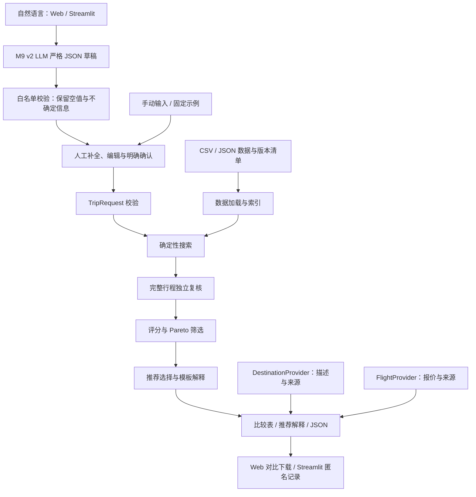

# 系统架构

状态：M9-001 产品层实现与交付验收进行中；M8 冻结 v1 结论 C 保留，v2 尚未独立评估。优化器、评分、Pareto 和 M1/M5 数据保持不变。  
最后更新：2026-09-22

## 系统概览

采用同一 Python 核心和两个薄界面：本地 Streamlit 保留历史演示与反馈下载；FastAPI 同源托管静态 Web 和产品接口，面向 GitHub/Vercel 公开演示。数据、输入、搜索和展示按模块分离，没有微服务或数据库。核心不依赖 LLM 或网络；服务端可选调用 DeepSeek 生成可编辑意图草稿。



## 主要组件与需求映射

| 组件 | 责任 | 对应 PRD |
| --- | --- | --- |
| 请求校验 | 类型、日期、集合、支持范围、报价口径和偏好检查 | FR-01 |
| 数据加载 | 外键/时间/来源校验，记录覆盖；M5 仍未建立机场/日期索引 | FR-02 |
| 搜索内核 | 联合枚举出发、目的地、顺序、停留、报价和返程；管理精确/截断状态 | FR-03、FR-04、FR-08 |
| 行程复核 | 从航段与访问记录重新计算硬约束，不只信任搜索累计值 | FR-04 |
| 评分与 Pareto 筛选 | 计算费用、交通负担、体验；候选间支配比较 | FR-05 |
| 推荐与解释 | 选 3–5 个有区别的结果，标签合并，计算展示方案间价格/时间/地点差值 | FR-06、FR-07 |
| 结果序列化 | 输出版本、数据限制、最优性边界、错误/无解/截断状态 | FR-07、FR-08 |
| 本地表单 | 复用模型和内核，展示对比 | FR-09，M3-001 已实施 |
| Pilot 记录 | 会话内生成行为字段与主观反馈，下载 JSON，不服务端存储 | FR-10，M3-002 已实施 |
| M6 场景与描述 | 加载固定真实决策场景；将不参与优化的目的地文案与优化字段分开展示 | FR-11、FR-12 |
| M9 AI 输入与确认边界 | 独立 v2 可空草稿、目录约束、本地复核、可编辑确认与安全回退；M7 v1 兼容路径保留 | FR-13、FR-14 |
| M8 评估边界 | 冻结自然语言语料、分项语义评分、重复运行、固定下游影响比较和模型权衡报告 | M8-001；不改变产品运行路径 |
| 数据提供者 | 带来源、版本、时间和模拟置信标记的报价/目的地接口，描述与优化参数分区 | FR-02、FR-12、FR-15 |
| Web 产品入口 | FastAPI 同源静态页面与输入/搜索接口，明确确认后复用核心、导出对比结果 | FR-09、FR-13、FR-14、FR-16 |

M8 位于产品调用链之外：`corpus-v1.json → Responses API（复用 M7 schema/prompt）→ validate_extraction → 分项评估`。只有同一 case 出现不同且合法的 TripRequest 时，评估器才把它们送入未修改的 `travel_core.search()`，并在固定 M5 small 报价子集上比较完整可行集、Pareto 集和代表排序。评估原始输出不会成为搜索数据，评估器也不会向模型提供 FlightOffer 或行程。

这些是同一应用内的模块职责，不是独立服务。核心模块通过内存对象交互；M9 仅在浏览器边界增加 `/api/bootstrap`、`/api/intent`、`/api/optimize` 和 `/api/health`。路线计算没有迁移到浏览器。

### M1 实际实现

[validation.py](../benchmark_tools/validation.py) 加载固定 JSON、校验数据与请求、复算明确列出的见证行程。[run.py](../benchmark_tools/run.py) 校验内容锁、场景预期和两个简单无解证据。它们覆盖 FR-01/02/04/05 的基准验证部分，不生成候选、不做排序或 Pareto 筛选，也不输出完整产品 SearchResult。

环境为 Python 3.12、tzdata==2024.2；其余均为标准库。时区数据直接读取固定依赖，避免操作系统版本差异。M2 已另行实现搜索器，M1 的见证清单仍不作为搜索候选输入。详见 [基准说明](benchmarks.md)。

### M2 实际实现

| 文件 | 职责 |
| --- | --- |
| [models.py](../travel_core/models.py) | 不可变行程状态与固定搜索配置 |
| [feasibility.py](../travel_core/feasibility.py) | 独立访问时间、完整路线约束与时间统计 |
| [scoring.py](../travel_core/scoring.py) | 费用、负担、体验与综合分；稳定路径 ID |
| [pareto.py](../travel_core/pareto.py) | 两两支配比较、稳定排序、代表方案和结构化取舍 |
| [search.py](../travel_core/search.py) | 深度优先完整搜索与结果结构 |
| [文件 CLI](../travel_core/__main__.py) | 加载本地请求/数据，输出 JSON |
| [oracle.py](../benchmark_tools/oracle.py) | 仅测试使用：目的地排列与报价笛卡尔积穷举 |

输入加载和数据/请求校验仍复用 M1 validation.py，不提前搬迁公共模型。生产搜索不导入 M1 evaluate_witness；测试 oracle 通过它独立重算所有结果。两套实现共享输入规则与时区数据，因此不宣称具有完全独立的数据解释来源。

### M3-001 UI 实现

`app.py` 只处理 Streamlit 生命周期和渲染；`travel_ui.demo_cases` 加载固定演示，`travel_ui.view_models` 把表单值转换成 TripRequest，并把 Itinerary 转成中文卡片模型。调用链为：

```text
Streamlit form → build_request → travel_core.search → itinerary_card → Streamlit cards
```

UI 把每个演示的 offer_ids 原样传给优化器，以保持可复现性。修改表单不会修改数据集或评分参数。缓存只用于只读 Dataset 和演示配置；搜索仍在每次提交时确定性执行。

### M3-002 Pilot 实现

`travel_ui.pilot` 生成随机匿名会话 ID，把搜索状态与展示方案组成 `product_telemetry`，把路线选择和评分组成 `subjective_feedback`。`app.py` 只把两部分合成 `pilot-record-v1` 并提供浏览器下载；服务器不写反馈文件，也没有第三方分析 SDK。

部署仍是同一单体：仓库根目录的 `app.py`、`requirements.txt` 与 `.streamlit/config.toml` 可由 Streamlit Community Cloud 直接运行。部署不需要 secrets。云实例的易失文件系统不承担反馈存储。

### M5-001 数据与性能工具

`data/m5` 是与 M1 fixture 隔离的 40 目的地、43 机场模拟目录。[generate.py](../data/m5/generate.py) 用固定公式生成 3,935 条报价和目的地元数据；搜索运行时不调用生成器。`benchmark_tools.m5_performance` 从同一目录构造 small/medium/large 嵌套子图，原样调用 `travel_core.search`，在外层测量时间和 Python 分配峰值。它不修改搜索状态、评分或 Pareto 语义。

M5 未添加服务或数据库。机器可读性能结果位于 `benchmarks/m5/latest-performance.json`，文档解释见 [M5 性能报告](m5-performance-report.md)。

### M6-001 决策展示层

`travel_ui.scenario_library` 加载四个 `m6-scenario-v1` 文件及固定报价 ID；`travel_ui.presentation` 从 `SearchResult` 构造推荐理由、相对取舍、对比行和目的地展示模型。`data/m6/destination_descriptions.json` 是只读描述目录，不被 `travel_core` 导入。

```text
M6 scenario → TripRequest + offer_ids → travel_core.search
SearchResult + display metadata → comparison rows + explanation cards
```

推荐解释以本轮实际展示方案为比较集合，使用可复算的价格、交通分钟、飞行日、目的地集合和优化器已给出的体验收益。它不重算 score-v1、不改变标签或 Pareto 结果。目的地卡片分别展示优化数据与模拟描述信息，防止展示文案成为隐藏评分输入。

### M7-001 AI 输入边界（保留的冻结 v1）

`travel_ui.natural_language` 动态从 DatasetManifest 生成严格 JSON Schema，仅暴露允许的国内机场、目的地 ID、偏好标签和覆盖日期。OpenAI Responses API 只做单次结构化提取，不获得航班报价或优化器结果。输出必须通过本地精确字段/类型检查和既有 `validate_request`，再由用户确认。

`app.py` 提供发现模式和手动规划模式。发现模式的链路为：

```text
prose → Structured Outputs → local validation → review → travel_core.search
```

API 缺失、响应错误或目录外地点不会触发搜索；手动模式不依赖 AI SDK 运行状态。LLM 结果本身可能变化，但相同的已确认 TripRequest、报价子集和版本仍产生确定性优化结果。

### M9-001 产品调用链

[`travel_product.intent`](../travel_product/intent.py) 新增 `m9-intent-v2`，与上述 v1 文件分离。模型只接收原始文字、机场/目的地标识与偏好目录；缺失必要条件保持 null，不根据演示范围猜年份。服务端校验草稿并标识缺失信息，界面显示假设、不确定项和可编辑字段。草稿不具备调用优化器的能力。契约与配置见 [M9 意图说明](m9-intent-contract.md)。

[`travel_product.service`](../travel_product/service.py) 编排已加载 Dataset、M6 示例、确认后的请求、既有搜索与卡片解释。`confirmed_request` 先执行交互边界和完整字段检查，再调用现有 `validate_request`；`optimize` 要求 `confirmed is True`。公开搜索固定使用 264 条 M6 报价、覆盖18个目的地；40个地点的资料目录并不扩充搜索边。

[`server.py`](../server.py) 同源提供 [`web`](../web/index.html) 的 HTML/CSS/JavaScript 与 FastAPI 接口。模型配置只从服务端环境读取，错误响应不透传上游异常。Web 使用请求大小限制、无缓存 API 响应、安全响应头和每实例12次/分钟的模型调用限制；后者不是分布式全局配额。不存在用户账户或服务端反馈持久化。发布部署以真实端到端验证为准。

Streamlit 的发现模式优先使用 DeepSeek v2，可编辑补全后明确确认；手动模式和历史演示保留。仅配置 OpenAI 时仍可走历史 v1 兼容入口，不能把该入口描述为通过可靠性门槛。两个界面都调用同一个 `travel_core`，未各自实现优化。

### M9-001 数据提供者与来源

[`travel_data`](../travel_data/providers.py) 定义 `FlightProvider` 和 `DestinationProvider` 协议及模拟实现。航班查询按出发机场当地日期建立只读查询索引，返回既有整数价格、航段、采样时间与版本；该索引不进入或修改核心搜索。目的地提供者从 [`data/m9`](../data/m9/destination_profiles.json) 读取40份描述，并从原 Dataset 读取建议夜数、标签和月份分，分别附上来源。

`confidence=simulated_unverified` 表示描述尚未核实，不是模型置信百分比。描述内容不回流到约束或评分。未来真实提供者先形成有版本的、经过同一校验的快照再交给搜索，不能在搜索过程中动态取价。详见 [提供者说明](m9-providers.md)。

## 数据流

1. 加载 DatasetManifest、机场、目的地、接入映射、报价及评分配置。
2. 校验外键、CNY 整数分、统一票价口径、带时区时间和报价内航段顺序。错误数据拒绝加载，不补造价格或时刻。
3. 校验 TripRequest，识别未覆盖机场/日期和不支持的请求。
4. 按起飞时刻与 ID 固定顺序扫描报价；使用所有适用目的地，不按偏好预筛。M2 不实现日期索引。
5. 对访问、停留和返程选择完整扩展，仅拒绝已违反硬约束的扩展；不使用启发式或支配剪枝。
6. 独立重算可行性与指标，筛选候选非支配集，确定展示标签和排序。
7. 输出 SearchResult，保存请求、数据版本、评分版本、搜索配置和运行摘要。
8. Pilot 页面从已展示结果生成匿名记录；该记录不回流搜索，也不改变排序。
9. M6 展示层读取描述目录并计算展示候选间差值；描述内容和差值不回流搜索。
10. M9 自然语言输入先在独立 v2 边界形成草稿，用户补全和确认后构造完整 TripRequest；原始文本和 LLM 元数据不进入优化状态。冻结 M7/M8 v1 仍供历史评估和兼容入口使用。
11. 产品展示通过 Provider 加入来源、更新时间、模拟置信度和目的地描述；这些字段不改写 SearchResult 或优化指标。

## 技术选择

| 选择 | 理由与界限 |
| --- | --- |
| Python 3.12 | 本机使用 3.12.1；依赖保持 tzdata==2024.2 |
| 标准库类型模型与显式校验 | 先满足少量本地输入，暂不引入独立校验框架 |
| JSON 为规范交换格式，CSV 为可选人工编辑入口 | JSON 能表达航段列表与嵌套结构；CSV 导入后必须通过同一模型校验 |
| 内存报价列表 | M5 已证明 40 目的地子图可加载，但逐状态扫描全部报价在 large 案例成为主要瓶颈；尚未实现索引 |
| 自定义精确搜索基准 | 便于审计约束与剪枝，性能未知时不先选复杂求解器 |
| JSON 和简单对比表 | M2 即可验证结果，无需完整网页 |
| Streamlit 1.44.1 | 保留本地交互、历史场景、AppTest 与匿名反馈下载 |
| FastAPI 0.141.1 + Uvicorn 0.53.0 + 静态 Web | 同源请求与静态页面共用 Python 核心，适配公开演示；没有前端构建链或独立业务服务 |
| 服务端 DeepSeek Responses API | 用现有 SDK 调用严格结构化输出，凭据仅服务端；v2 的可靠性仍需独立评估 |
| Python Protocol 与固定 JSON 提供者 | 形成未来数据替换点，明确模拟来源，避免现在接入商业库存 |
| 模板解释 | 对费用、时间和偏好差值可追溯，不需要语言模型 |

## 失败、覆盖与最优性

SearchResult.status、search_complete、optimality_scope 与 coverage_warnings 分开建模，详见 [数据模型](data-model.md)。例如，完整搜索找不到方案是 `no_feasible_in_dataset`；搜索被截断且尚未找到方案是 `search_incomplete`。二者不能混淆。

加载数据之外的航班未知。即使精确模式完成，也只在该数据快照和离散规则内完整。缺报价通过覆盖说明披露，不推断真实航线不存在。

## 后续边界

未来真实数据接入通过新的 Provider 实现生成同样的 FlightOffer 与 DatasetManifest，仍由同一校验入口加载；现有协议不构成商业接口接入。M5 结果支持先评估搜索索引和安全剪枝，再决定标签 DP 或明确标注的近似模式。公开演示属于 M9 授权交付，真实用户研究、外部票价服务和生产容量规划仍需后续证据与单独范围。

相关决策见 [ADR](decisions.md)，性能与数据覆盖边界见 PRD 的 A-06、A-08 及 [M5 报告](m5-performance-report.md)。

