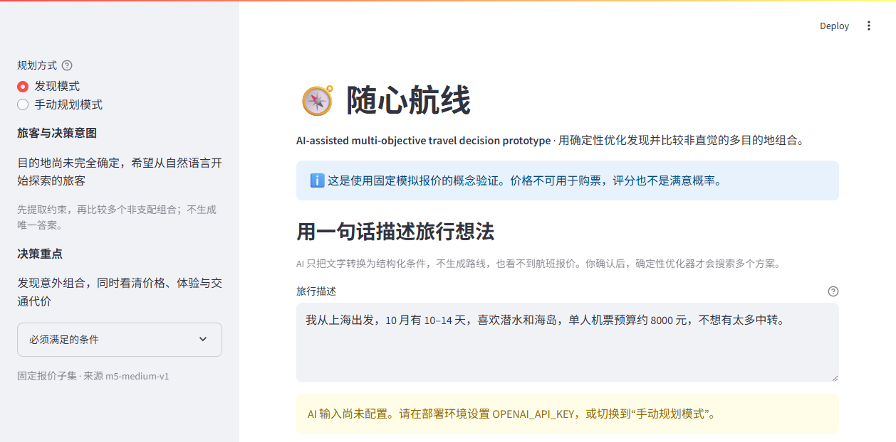
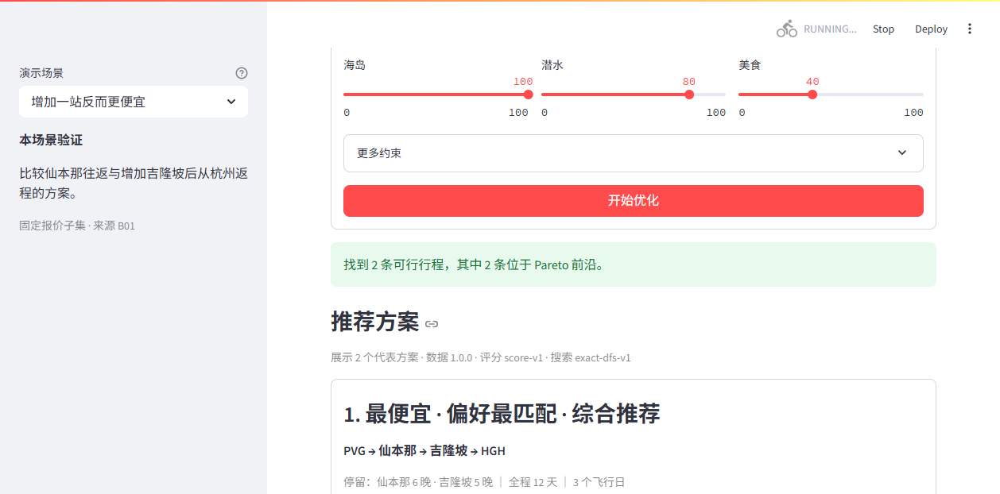
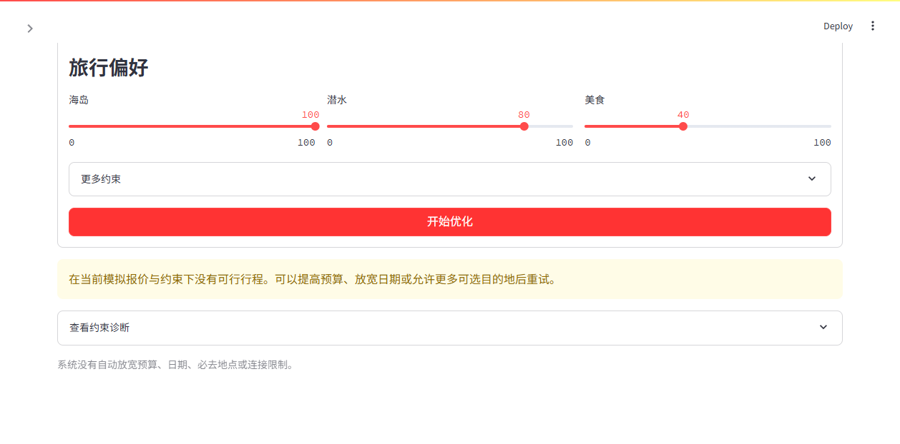

# 交互演示指南

状态：M7-001 AI 决策演示版本。  
最后更新：2026-09-17

## 启动

需要 Python 3.12。首次运行：

```powershell
py -3.12 -m pip install -r requirements.txt
py -3.12 -m streamlit run app.py
```

打开 `http://localhost:8501`。默认进入发现模式；自然语言提取需要 `OPENAI_API_KEY`，配置见 [M7 部署准备](m7-deployment.md)。没有密钥时切换到手动规划模式，路线搜索仍可完整运行。LLM 只理解输入，路线仍由确定性优化器生成。

## M7 推荐演示流程

1. 在发现模式输入：“我从上海出发，10 月有 10–14 天，喜欢潜水和海岛，单人机票预算约 8000 元，不想有太多中转。”
2. 点击“AI 提取旅行条件”，检查日期、时长、预算、偏好、中转上限、假设和未解析内容。
3. 点击“确认条件并生成多个方案”；此时才调用确定性优化器。
4. 比较价格差、交通时间差、新增目的地、体验收益和主要取舍。
5. 展开任一方案查看确定性解释，并切换到手动模式验证完整回退路径。

AI 不接触航班报价，不生成路线；解释层也不调用 LLM。部署与失败处理详见 [M7 原型说明](m7-ai-decision-prototype.md)。



## 使用方式

以下步骤适用于手动规划模式：

1. 从左侧选择毕业旅行、海岛潜水、长假探索或高品质放松场景。
2. 查看用户画像和意图，再调整出发/返程机场、日期窗口、总行程天数、模拟机票预算和必去/优选目的地。
3. 调整七类偏好；“更多约束”可控制可选目的地和每张报价的中转数。
4. 点击“开始优化”。
5. 先用方案表比较价格/交通差、新增目的地和主要取舍，再展开卡片理解推荐理由与目的地信息。
6. 选择会优先核对的路线，填写结构化反馈并下载 JSON 测试记录。

M6 四个场景使用 `data/m5` 和 264 个固定报价 ID，保证结果可复现；场景不保存预期优化答案。原 M3 技术演示和“自定义探索”仍保留并使用 `data/m1`，用于回归边界行为。

M6 日期窗口为 2027-10-01 至 2027-10-22。预算是单人 CNY 模拟机票预算；地面接驳估价另算。机场中转不算到访目的地。

## 四个 M6 决策场景

| 场景 | 核心决策 |
| --- | --- |
| 毕业旅行 | 有限预算下比较海滩、美食和交通复杂度 |
| 海岛潜水旅行 | 保留必去仙本那，比较额外地点带来的价格、体验与负担 |
| 长假探索 | 在没有必去或优选地点时发现多种路线组合 |
| 高品质放松 | 较高预算下优先低中转和放松体验 |

完整字段见 [M6 场景库](m6-scenarios.md)，主持步骤见 [M6 演示流程](m6-demo-flow.md)。

## 保留的 M3 技术回归场景

| 场景 | 默认条件 | 应看到什么 |
| --- | --- | --- |
| 必去仙本那 | 必去 SEMPORNA，可选地点上限 0，预算 ¥5,000 | 只访问仙本那的 ¥3,600 方案 |
| 增加一站反而更便宜 | 必去 SEMPORNA，可加地点，预算 ¥5,000 | ¥2,800 的仙本那 + 吉隆坡方案，以及 ¥3,600 的较省力基线 |
| 预算改变推荐 | 同一报价集，预算降到 ¥3,000 | 直接往返超预算，只剩 ¥2,800 的两地方案 |
| 预算内没有可行方案 | 预算 ¥1,000 | 明确无解，系统不自动放宽约束 |

配置位于 [demos](../demos/)。每个配置包含完整请求和允许的报价 ID；它们不改变 M1 基准文件。

## 截图

M6 默认输入与方案对比：


以下是保留的 M3 技术回归截图。

默认输入表单：


默认场景的推荐结果：



把预算改为 ¥1,000 后的无解状态：



Pilot 路线选择与结构化反馈：


截图来自 Windows 本地 Streamlit 1.44.1 和实际浏览器会话。推荐截图位于提交按钮后的页面位置，用于突出结果区域。

## 如何解读

- “最便宜”“最少折腾”“偏好最匹配”“综合推荐”来自确定性 Pareto 前沿和显式评分。
- 交通负担综合交通时长、飞行日、中转和夜间飞行；分数越低越轻松。
- 偏好/停留收益综合标签匹配、停留饱和和月份系数；分数越高越匹配。
- 综合分是当前 score-v1 权重的排序工具，不是满意概率。
- Trade-offs 相对本轮综合推荐展示机票、交通分钟和飞行日差异。
- M6 对比差值只相对本轮展示方案；“新增目的地”相对目的地最少的展示基线。
- 目的地的描述性信息不进入搜索、硬约束或评分；界面将其与优化数据分区。
- “无可行方案”只表示当前模拟报价不能同时满足全部约束，不表示现实中没有航班；页面不会自动放宽条件。

## 当前限制

- 所有数据均为模拟，不能购票，也不能证明现实中增加目的地会更便宜。
- 每个演示使用隔离报价子集；用户能改请求，但不能在页面编辑底层航班。
- M6 使用 40 个目的地、43 个机场目录中的固定子图；M3 回归仍只有 9 个机场、6 个目的地和 15 条报价。
- 搜索为完整枚举；M5 已测量规模边界，长假大组合仍可能变慢。
- 不包含自行转机拼接、地面串游、酒店、活动、签证、支付或登录。
- 页面刷新会清空最后一次结果和未下载反馈；没有数据库，公开地址需由仓库所有者部署。
- Pilot 记录不会自动上传；参与者必须下载 JSON 并交给主持人。

首轮任务、问题和记录流程见[用户测试手册](user-testing.md)，字段与判定规则见[Pilot 指标](pilot-metrics.md)。
