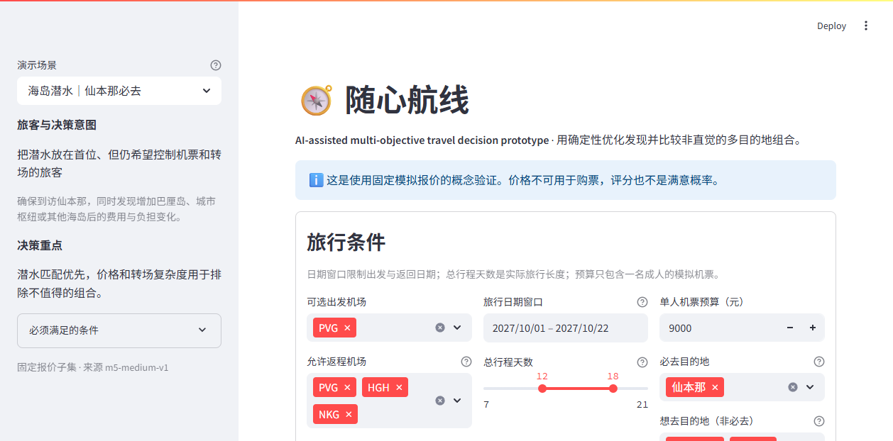
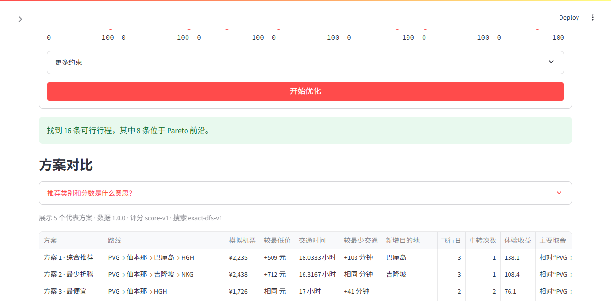

# M6 产品演示流程

状态：可重复本地演示。  
最后更新：2026-09-16

## 演示目标

用一个完整决策过程回答：系统能否帮助用户发现并比较没有事先指定的旅行组合。演示不用于证明现实节省、市场需求或可预订性。

## 准备

```powershell
py -3.12 -m pip install -r requirements.txt
py -3.12 -m streamlit run app.py
```

打开 `http://localhost:8501`。默认选择“海岛潜水旅行”；所有报价和目的地描述都明确标为模拟。

## 五步演示

1. **从模糊意图开始。** 说明用户只确定从上海出发、约两周、想潜水且必须去仙本那，并未指定完整路线。
2. **确认约束与偏好。** 展示日期窗口、时长、模拟机票预算、必去仙本那、潜水/海岛权重和可接受中转。点击“开始优化”。
3. **先比较，再看分数。** 在方案对比表查看路线、模拟机票、相对最低价、交通时间、相对最少交通、新增目的地和主要取舍。
4. **理解一条推荐。** 展开“为什么推荐”，说明价格优势或溢价、体验匹配、交通负担和相对其他展示方案的代价。继续展开目的地信息，指出优化数据与展示信息的边界。
5. **让用户作决定。** 请用户选择最愿意继续核对的方案，并复述原因。系统支持选择，不宣称存在唯一正确答案。

默认场景输入：



运行后的方案对比：



## 四场景演示重点

| 场景 | 要观察的产品问题 |
| --- | --- |
| 毕业旅行 | 有限预算下，用户是否愿意用更多交通换取海滩/美食组合 |
| 海岛潜水旅行 | 必去地点是否始终保留；额外地点带来的价格或体验变化是否容易理解 |
| 长假探索 | 没有必去和优选地点时，系统能否提供有区别且可解释的灵感 |
| 高品质放松 | 较高预算和低中转容忍度下，用户是否能识别更省力的方案 |

## 主持人检查清单

- 页面定位文字是 “AI-assisted multi-objective travel decision prototype”。
- 输出保留用户硬约束，且无解时不自动放宽。
- 对比中的差值只相对本轮展示方案；“新增目的地”相对展示方案中目的地最少的基线。
- 所有价格表述都带有模拟语境，不描述为真实节省。
- 综合分解释为固定 score-v1 的排序工具，不描述为满意概率。
- 不演示预订、账户、酒店、支付、实时库存或自动旅行代理。

## 复现说明

场景、报价 ID、数据版本和搜索顺序均固定。相同代码和 Python 环境下，重复提交应产生相同路线、指标和顺序。界面解释只读取优化器结果并计算展示候选间差值，不修改 score-v1 或 Pareto 集。
