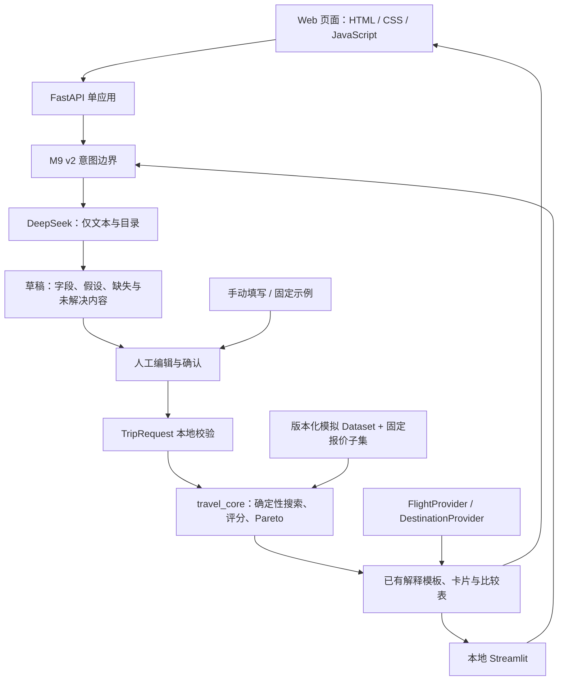

# 随心航线：从旅行想法到可比较的路线组合

产品定位：**AI-assisted multi-objective travel decision prototype**。  
本文对应 M9 产品实现，日期：2026-09-22。真实用户验证仍未开展。

随心航线帮助目的地尚未完全确定的旅客，联合考虑目的地组合、顺序、日期、停留和返程机场。交付形态包括面向分享的 Web 演示，以及保留技术场景和反馈记录的本地 Streamlit 应用。LLM 负责理解旅行描述；确定性优化器负责生成和比较路线。

[公开演示](https://travel-route-poc.vercel.app) · [代码仓库](https://github.com/yuyangjungle/travel-route-poc) · [交付与测试报告](m9-results.md)。

## 问题与产品洞察

传统航班搜索很适合已经知道出发地、目的地和日期的人。多站旅行的规划却常从另一种状态开始：知道能从哪里出发、假期有多长、预算多少，以及一两个必去地点，其余选择仍然开放。

例如，一位从上海出发、必须去仙本那的旅客，还可能愿意加入巴厘岛、吉隆坡或其他城市。每增加一个地点，都可能改变机票费用、顺序、停留天数和返程机场。手动规划需要在多个查询之间反复记录、比较和舍弃组合。

产品洞察是：用户最终需要决定的是一整趟旅行。某段机票更便宜，并不能单独证明整个方案更好；更丰富的体验也可能带来更多交通。产品需要把这些取舍放在同一个决策界面里。

这是一个待真实用户验证的产品假设。当前证据能证明算法和演示流程工作，不能证明用户会因此节省真实费用、提高规划效率或愿意付费。

## 解决方案与关键产品取舍

用户先用自然语言表达想法，或载入示例、手动填写。AI 返回可编辑的条件草稿，明确列出假设、缺失和不确定信息。用户核对日期、预算、地点、偏好与中转限制后，系统才把确认后的条件交给确定性引擎。

引擎对固定报价子集进行完整搜索，保留在费用、交通负担和偏好体验之间有不同取舍的方案。展示层给出最便宜、最少折腾、偏好最匹配、综合推荐等代表路线，并解释每一条的收益和代价。同一方案可能同时承担多个推荐角色。

| 产品选择 | 原因与实现边界 |
| --- | --- |
| LLM 只提取意图 | 模型不接收 FlightOffer，不生成路线，不决定预算或必去地点是否满足 |
| 确认页允许修改全部条件 | 日期、机场、预算、旅行天数、必去/优选地点、标签权重和中转限制可以逐项核对 |
| 缺失信息保持空白 | M9 v2 不为了形成完整请求而自动猜测年份；缺失项需要人工补全 |
| 多目标比较 | 展示几条值得继续核对的路线，允许用户自行决定价格、舒适度和体验哪个更重要 |
| 先用固定模拟数据 | 保持演示可复现，隔离数据变化与算法变化；报价不可购买 |
| 明确区分资料与计算参数 | 活动、季节描述和资料可信度帮助理解目的地，描述文字不进入评分或搜索 |
| 保留手动与示例入口 | 模型不可用或理解错误时，用户仍能完成条件确认、搜索和比较 |

## 技术架构

公开演示采用 Vercel 可部署的 Python FastAPI 入口，静态页面和接口来自同一个应用。浏览器只维护表单和展示状态。`/api/intent` 调用模型形成草稿，`/api/optimize` 在显式确认和本地校验后调用搜索。模型密钥从服务端环境读取，不下发到浏览器。

Streamlit 复用意图边界、TripRequest 校验、优化器和展示组件，同时保留历史基准场景与匿名反馈下载。两种界面都遵循“先确认，再搜索”；它们没有各自实现路线优化算法。

数据提供者接口封装报价、目的地资料、版本、时间和来源。当前搜索仍读取已验证的固定 Dataset，服务层用模拟提供者补充报价来源和目的地档案。未来真实提供者必须先完成字段、时区、币种、行李口径和来源校验，再形成搜索快照；仅实现接口不代表已接入真实库存。详见 [提供者说明](m9-providers.md)。

## 数据范围与可复现演示

M5 模拟目录包含 40 个目的地和 43 个机场；M9 目的地档案覆盖这 40 个地点。公开交互搜索使用 M6 固定子集，实际覆盖 **18 个目的地、264 条模拟报价**，演示日期集中在 **2027-10-01 至 2027-10-22**。

目录存在某个地点，并不代表固定搜索子集包含其航班。页面给缺少演示报价的地点作出标注；无解不会被解释成现实市场无航班。费用统一为一名成人、CNY、含税且满足既定行李口径的模拟机票，不包含酒店或活动费用。

在未修改的“海岛潜水｜仙本那必去”示例中，当前实现得到 16 条可行行程、8 条 Pareto 行程、5 条代表方案。最低模拟机票为 ¥1,726，交通总时长 17 小时；最少折腾方案为 ¥2,438，交通总时长约 16 小时 19 分钟。这个例子用于展示“最低价”和“最少负担”可以不同，不表示现实中存在这些报价或能够节省相应金额。

自然语言抽取可能得到不同条件，因此不应要求 AI 每次产生上述固定结果。需要复现算法演示时，使用版本化示例的结构化字段。

## 已有验证证据与未解决风险

| 证据 | 支持什么结论 | 不支持什么结论 |
| --- | --- | --- |
| M1 固定 fixture 与内容锁 | 基准输入和手工预期可追踪 | 模拟报价具有现实代表性 |
| M2：20 个场景与独立穷举 oracle 对照 | 已验证小规模完整可行集与 Pareto 集的一致性 | 全球航班网络上的最优性或交互性能 |
| M6：四组场景重复搜索一致 | 固定输入、报价和版本可复现 | 用户喜欢这些推荐 |
| M8：120 个 evaluation case × 3，360 次真实调用 | 冻结 v1 输入边界存在显著可靠性问题 | 新契约 v2 已经达到 Pilot 标准 |
| M9 Streamlit：原 4 项冒烟测试与新增 6 项确认流程测试通过 | 可编辑确认、缺失信息阻断、失效状态和错误脱敏受到回归检查 | 完整浏览器、上线或真实用户验收已自动完成 |

M8 冻结 v1 结果保留，结论为 **C，未达到 Pilot 门槛**。Schema/local-validation 合法率为 190/360（52.778%）；需要人工修正为 221/360（61.389%）；危险语义错误 34 次。43 个产生不同有效 TripRequest 的 case 中，4 个导致无可行解，8 个实质违背意图。完整结果见 [M8 报告](m8-results.md)。

M9 新增 `m9-intent-v2`，允许缺失值、明确人工确认，并与冻结 v1 分开维护。**v2 尚未经过独立、校准后的可靠性评估。** 功能演示成功和人工确认界面都不能替代这一评估，也没有证明用户一定能识别每个语义错误。详见 [意图契约](m9-intent-contract.md)。

## 面向面试或 OTA 交流的三分钟演示

1. **前 30 秒：说明决策问题。** 展示“目的地未定，但预算、假期和必去地点已知”的例子，指出需要同时比较组合与交通代价。
2. **30–90 秒：表达与确认。** 输入旅行描述，指出缺失年份会保持空白；手动补为 2027 年、核对返程机场和预算，然后确认。
3. **90–150 秒：比较。** 并排查看最低价、最少折腾和偏好方案。用当前显示的价格差与交通差解释一种具体取舍，再展开一条路线的航段和目的地档案。
4. **最后 30 秒：给出证据和边界。** 说明路线由确定性引擎计算、M2 oracle 对照通过、价格全部模拟，同时主动展示 M8 失败结果与 v2 尚未完成评估的事实。

操作步骤和可复现示例见 [M9 演示流程](m9-demo-flow.md)。

## 后续路线

| 方向 | 下一步要获得的证据 | 推进条件 |
| --- | --- | --- |
| AI 输入可靠性 | 使用独立开发数据迭代 v2，再用未消费 holdout 或新独立集评估语义与下游影响 | 达到预先定义的可靠性门槛，保留逐字段确认 |
| 用户反馈 | 小规模观察用户能否理解取舍、修正误解，并选择值得继续核对的路线 | 明确风险、任务和记录协议后单独授权用户测试 |
| 真实航班数据 | 接入少量可靠且有使用授权的报价，验证来源、时间、行李口径与快照复现 | 数据质量与成本足以支持相同条件下比较 |
| OTA 集成 | 以已确认 TripRequest 和可解释方案作为边界，验证与既有搜索流程衔接 | 先明确合作场景、数据契约和可衡量价值，不扩成全量 OTA |

当前没有支付、预订、账户或自主旅行代理，没有真实价格节省、商业成功或真实用户验证结论。

## 演示截图

[移动端](screenshots/m9-mobile.png) · [Streamlit](screenshots/m9-streamlit.png)
