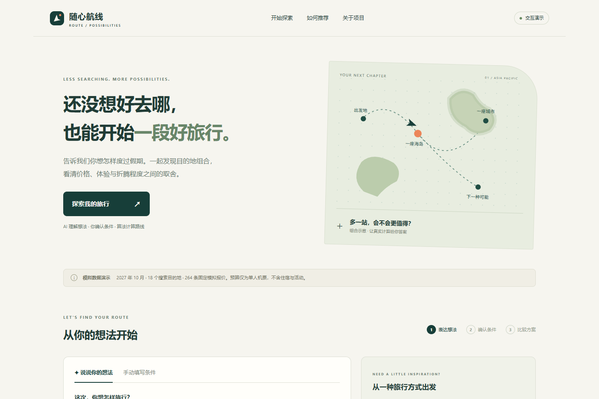
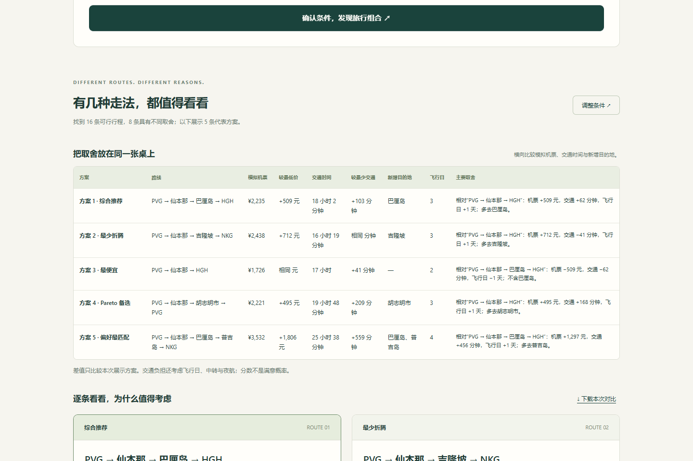

# M9-001 交付报告

日期：2026-09-22。产品定位：**AI-assisted multi-objective travel decision prototype**。

公开演示：[https://travel-route-poc.vercel.app](https://travel-route-poc.vercel.app)。GitHub 发布与 CI 状态在最终交付时核验。

## 已实现

- 同源 Web 首页、自然语言/手动输入、四类示例、可编辑条件确认、比较表、推荐卡、解释、目的地资料与 JSON 下载。
- 保留并升级 Streamlit：同一搜索核心、同一固定演示数据、AI 确认和手动回退。
- 独立 `m9-intent-v2` 草稿边界：空值、不确定项、假设和白名单校验；确认后才构造 TripRequest。冻结 v1 未改。
- FlightProvider / DestinationProvider 与来源、时间、版本；40 份模拟描述独立于评分。固定 Web 搜索范围为18目的地、264报价。
- FastAPI 单应用、服务端 Secret、固定直接依赖、干净安装验证、GitHub CI、部署和产品案例文档。

核心职责：LLM 提取条件；`travel_product` 编排与确认；`travel_core` 执行确定性搜索、评分、Pareto；`travel_ui` 解释；`travel_data` 提供版本化模拟数据。没有航班API、账户、支付或预订。

## 验证证据

| 检查 | 结果 |
| --- | --- |
| 本地全量 unittest | 158/158通过，37.356秒 |
| 临时干净环境安装与测试 | 158/158通过，30.074秒；Streamlit1.44.1可用 |
| M2独立oracle | 20/20场景完整可行集与Pareto集一致 |
| M5确定性生成 | 6文件字节一致 |
| M8冻结边界 | 原prompt/schema/核心/数据/语料哈希验证通过；holdout未消费 |
| M6四场景 | HTTP层与原搜索的计数、指纹和输出保持一致（测试覆盖） |
| Web线上固定潜水场景 | 16可行、8 Pareto、5代表方案；最低模拟机票¥1,726 |
| Streamlit真实浏览器 | 相同16/8/5；预算1元无解，旧卡片清除；无页面异常 |
| 线上自然语言完整旅程 | 模糊输入→缺失项确认→用户补充机场/日期/天数/预算/地点→11可行、6 Pareto、5代表方案 |
| 修改条件与无解 | 修改预算清除确认和旧结果；1元预算显示无解，不自动放宽 |
| 移动端 | 390px视口，文档宽390px；比较表在容器内横向滚动 |
| 前端与仓库凭据检查 | 前端只访问同源API；待发布文件扫描无真实key格式匹配，Secret文件被忽略 |

自然语言旅程与固定场景的条件不同，所以候选数不同；这不是优化器不确定性。测试与截图均使用合成内容，不是真实参与者数据。

## 真实模型观察，不能当准确率

真实 DeepSeek 已在本地和线上调用。缺失年份、上海机场歧义、“12天左右”等会显示待补充项，用户修正后可继续搜索。也观察到两类失败：

1. 部分结构化草稿未通过本地校验，界面安全拒绝并提供手动模式；不能声称每次AI请求都成功。
2. 一次模糊预算被解释为单人机票预算，即使在假设中披露，也存在语义风险；演示时用户明确修正预算后再确认。

这些是少量开发冒烟观察，没有随机抽样、没有预注册新评估，也没有估算模型准确率。M8 v1 的 C 结论仍有效；v2 尚未完成独立可靠性验收。人工确认仍必要，但尚未证明用户能发现所有错误。

## 截图

[AI待补充项](screenshots/m9-confirmation.png) · [手机展示](screenshots/m9-mobile.png) · [Streamlit结果](screenshots/m9-streamlit.png)

## 限制与下一步

当前展示的是模拟报价中的选择，不是现实节省或可购买行程。描述资料全部模拟未核实；覆盖外无解不代表现实没有航班。真实用户价值未验证。公开AI接口只做实例内保护，没有跨实例费用配额；依赖供应商可用性，保留手动回退。当前发布通过CLI，GitHub CI不自动部署。

建议下一里程碑：以独立开发样本修正 v2 语义边界，冻结版本和准入门槛后使用独立评估集，同时设计用户是否能识别并修正错误的观察任务。达到可靠性与决策理解门槛后，再考虑有限范围可靠报价接入。当前不继续添加功能。
